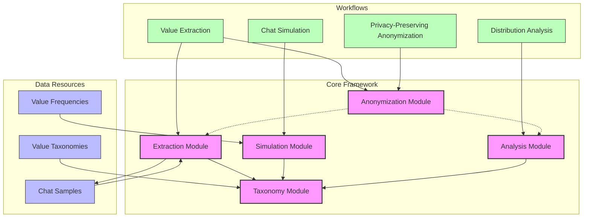
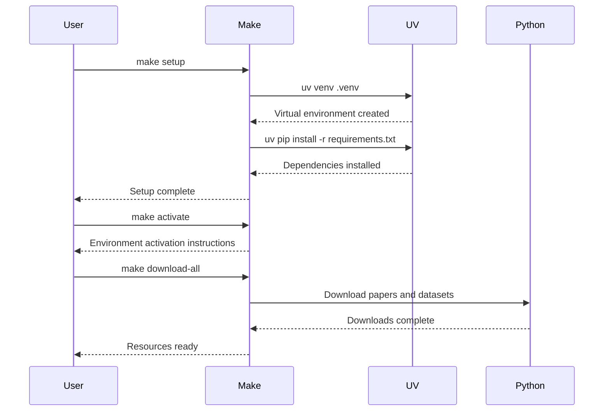

# Values in the Wild: Implementation and Analysis Framework

A comprehensive toolkit for implementing, analyzing, and validating AI value alignment based on Anthropic's "Values in the Wild" research.

## Architecture



## Environment Setup

This project uses `uv` for Python dependency management and `make` for workflow automation.

### Prerequisites

- Python 3.9+
- uv (Python package manager)
- Make

### Setup Workflow



## Getting Started

1. **Clone the repository:**
   ```bash
   git clone https://github.com/defrecord/value-alignment-toolkit.git
   cd value-alignment-toolkit
   ```

2. **Set up the environment:**
   ```bash
   make setup
   ```
   This will create a virtual environment using uv and install all dependencies.

3. **Activate the environment:**
   ```bash
   source .venv/bin/activate  # or use 'make activate' for instructions
   ```

4. **Download required resources:**
   ```bash
   make download-all
   ```

5. **Run a sample analysis:**
   ```bash
   make sample-analysis
   ```

## Project Structure

- `src/`: Core implementation modules
  - `extraction/`: Value extraction algorithms
  - `simulation/`: Chat system simulation
  - `anonymization/`: Privacy-preserving techniques
  - `analysis/`: Statistical tools and visualizations
  - `taxonomy/`: Value hierarchy implementation

- `data/`: Data resources and outputs
  - `values/`: Reference data including value frequencies and taxonomies
  - `samples/`: Generated and anonymized conversation datasets

- `tools/`: Utility scripts
  - `download/`: Scripts to fetch relevant research papers and resources
  - `validation/`: Tools for testing and validating the implementation

- `docs/`: Documentation
  - `tutorials/`: Implementation guides and usage examples
  - `paper/`: Summaries of research methodology and key findings

## Available Commands

Run `make help` to see all available commands.

## License

[Appropriate license information]

## Acknowledgments

This work builds upon research by Anthropic's "Values in the Wild" paper authored by Saffron Huang, Esin Durmus, et al.